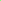

# skepsis

> Is your backtest result real, or overfit?

skepsis takes the returns of a backtested strategy — and, ideally, the
returns of **every variant you tried along the way** — and produces
statistical evidence for or against the result being luck, plus a
self-contained HTML report you can hand to a PM.



```bash
pip install skepsis
```

```python
import skepsis

result = skepsis.evaluate(returns, trials=trials_df, params=params_df, freq="daily")
print(result.summary())
result.save_html("skepsis_report.html")
```

Start with the demo: [Deflating the Golden Cross](https://github.com/abhinay/skepsis/blob/main/notebooks/deflating-the-golden-cross.ipynb)
— a Sharpe-1.46, 650× backtest on 11 years of BTC, and what's left of it
once you account for the 34 variants tried (spoiler: a DSR of 0.35).

skepsis is **not a backtester**. It sits downstream of whatever you use to
generate returns, and it never silently repairs bad input: NaNs are
rejected, strained assumptions are warned about, skipped diagnostics say
why. Every implementation is verified against published paper values —
including the DSR paper's own numerical example, reproduced to all four
printed decimals.
